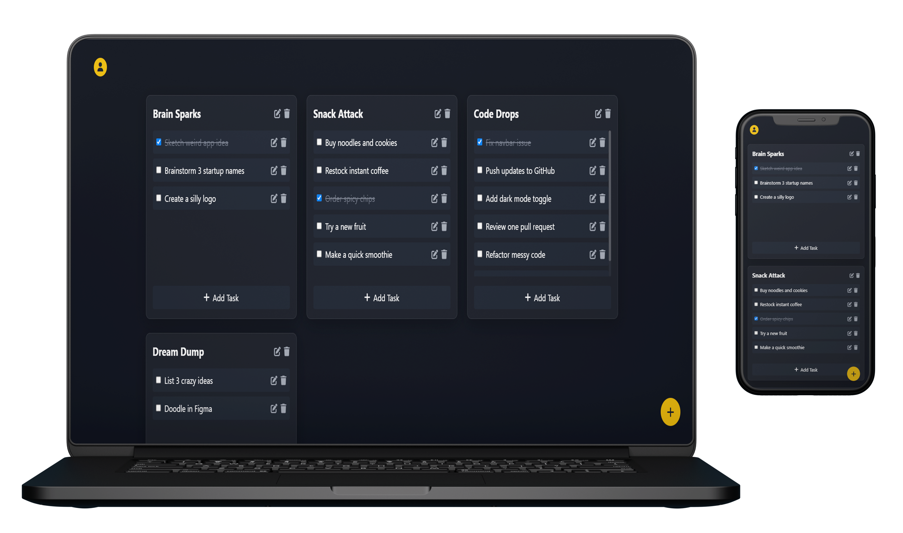

# Notoviax Website

## Overview
A simple and clean note-taking web app that helps you organize your ideas, tasks, and plans efficiently! Built with a beautiful dark theme, smooth interactions, and categorized task management.

## Features
- Add, edit, and delete tasks easily
- Organize tasks into multiple categories (e.g., Brain Sparks, Snack Attack, Code Drops, Dream Dump)
- Mark tasks as completed
- Responsive and minimal dark-themed UI
- User-friendly experience with intuitive controls
- Floating Action Button for quick task creation

## Mockup

## Website
Visit the live website: [Notoviax](https://arshadziban.github.io/Notoviax_website/)